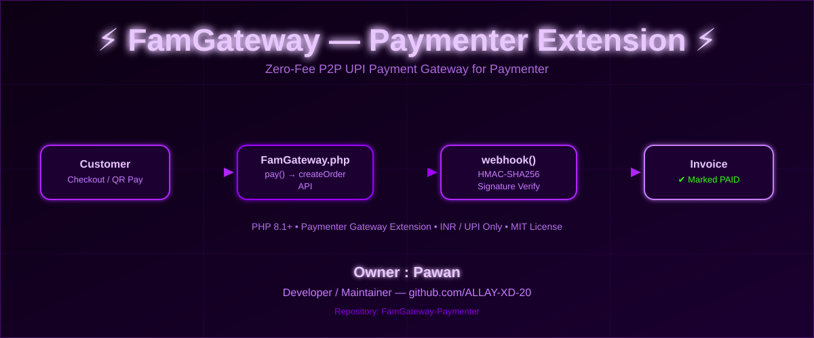

<div align="center">



[](https://php.net)
[](https://paymenter.org)
[](#)
[](#license)
[](https://github.com/ALLAY-XD-20/FamGateway-Paymenter/stargazers)
[](https://github.com/ALLAY-XD-20/FamGateway-Paymenter/issues)

</div>

## Overview

**FamGateway** is a [Paymenter](https://paymenter.org) payment gateway extension that plugs your billing panel directly into **FamGateway** — a zero-fee, peer-to-peer **UPI** payment gateway. Customers get redirected to a hosted checkout (or scan a UPI QR code as a fallback), and invoices are automatically marked as paid the moment FamGateway confirms the transaction.

Built for hosting panels, digital storefronts, and any Paymenter-powered billing system that needs frictionless, fee-free UPI payments.

<br>

## Features

| Feature | Description |
|---|---|
| **Hosted Checkout** | Redirects customers to FamGateway's hosted `checkout_url` for a seamless payment flow |
| **UPI QR Fallback** | Displays a `qr_url` UPI QR code if the customer prefers to scan-and-pay |
| **Signed Webhooks** | Verifies every webhook via `X-FamGateway-Signature` using timing-safe HMAC-SHA256 |
| **Zero-Fee UPI** | Leverages FamGateway's zero-fee P2P UPI rails — no card processing overhead |
| **INR Native** | Purpose-built for INR invoices; gracefully blocks unsupported currencies |
| **Drop-in Extension** | Standard Paymenter `Gateway` extension — install, configure, done |

<br>

## Repository Structure

```
FamGateway-Paymenter/
├── FamGateway.php                 # Paymenter Gateway extension class (config, pay, webhook)
├── Includes/
│   └── FamGatewayClient.php       # Original SDK logic (renamed to avoid class collision)
├── routes/
│   └── web.php                    # Webhook + redirect callback routes
├── views/
│   ├── pay.blade.php              # Hosted checkout redirect + QR fallback view
│   └── error.blade.php            # Unsupported currency error view
└── .github/workflows/             # CI workflows
```

<br>

## Installation

```bash
# 1. Copy the extension into your Paymenter installation
cp -r FamGateway extensions/Gateways/

# 2. Enable it from the Paymenter admin panel
#    Admin -> Extensions -> Gateways -> FamGateway -> Enable

# 3. Add your FamGateway API Key
#    Format: sk_live_...
```

| Step | Action |
|:---:|---|
| 1 | Copy the `FamGateway` folder into `extensions/Gateways/` |
| 2 | Enable **FamGateway** from the Paymenter admin panel |
| 3 | Paste your `sk_live_...` API key into the gateway settings |
| 4 | Save — you're ready to accept UPI payments |

<br>

## How It Works

```
Customer -> pay() -> FamGateway createOrder API -> checkout_url / qr_url
                                                        |
                                                        v
                                          views/pay.blade.php (auto-redirect)
                                                        |
                                                        v
                                     Customer completes payment via UPI
                                                        |
                                                        v
                        FamGateway -> webhook (X-FamGateway-Signature) -> webhook()
                                                        |
                                                        v
                              HMAC-SHA256 verified -> ExtensionHelper::addPayment()
                                                        |
                                                        v
                                             Invoice marked as PAID
```

- `pay()` calls FamGateway's `createOrder` API to retrieve a `checkout_url` / `qr_url`, then renders `views/pay.blade.php`, which auto-redirects the customer to the hosted checkout (showing the UPI QR as a fallback).
- The invoice ID is embedded directly in the per-order `redirect_url` and `webhook_url` (`/extensions/gateways/famgateway/webhook/{invoiceId}`), since FamGateway's API has no order-metadata field to round-trip an invoice ID the way Razorpay's `notes` does.
- `webhook()` verifies the `X-FamGateway-Signature` header with HMAC-SHA256 (timing-safe `hash_equals`) using your API key as the secret — exactly as in the official SDK — then marks the invoice paid via `ExtensionHelper::addPayment()` on a `payment.success` / `success` event.
- Only **INR** invoices are supported (FamGateway is UPI-only) — other currencies show a friendly error view, the same pattern used by the Razorpay extension.

<br>

## Security Note

> **Important:** FamGateway's `createOrder` / `getOrderStatus` endpoints currently send the API key as a **URL query parameter** (inherited as-is from the original SDK). This means the key can end up in web server access logs or any proxy/CDN logs in front of `famgateway.in`.
>
> If you plan to distribute this extension publicly, consider reaching out to FamGateway support to ask whether the API key can be passed via an `Authorization` header instead.

<br>

## Requirements

- A working [Paymenter](https://paymenter.org) installation
- A FamGateway merchant account with a live API key (`sk_live_...`)
- PHP 8.1+
- INR-based invoicing enabled on your Paymenter store

<br>

## Contributing

Contributions, issues, and feature requests are welcome.

1. Fork the repo
2. Create your feature branch (`git checkout -b feature/amazing-feature`)
3. Commit your changes (`git commit -m 'Add amazing feature'`)
4. Push to the branch (`git push origin feature/amazing-feature`)
5. Open a Pull Request

<br>

## License

This project is licensed under the **MIT License**.

<br>

<div align="center">

**Owner / Developer:** [Pawan](https://github.com/ALLAY-XD-20) — [github.com/ALLAY-XD-20](https://github.com/ALLAY-XD-20)


</div>
